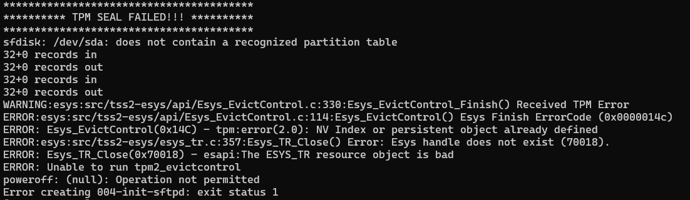

# TPM Clear 필요한 경우



```
****************************************
********** TPM SEAL FAILED!!! **********
****************************************
sfdisk: /dev/sda: does not contain a recognized partition table
32+0 records in
32+0 records out
32+0 records in
32+0 records out
WARNING:esys:src/tss2-esys/api/Esys_EvictControl.c:330:Esys_EvictControl_Finish() Received TPM Error
ERROR:esys:src/tss2-esys/api/Esys_EvictControl.c:114:Esys_EvictControl() Esys Finish ErrorCode (0x0000014c)
ERROR: Esys_EvictControl(0x14C) - tpm:error(2.0): NV Index or persistent object already defined
ERROR:esys:src/tss2-esys/esys_tr.c:357:Esys_TR_Close() Error: Esys handle does not exist (70018).
ERROR: Esys_TR_Close(0x70018) - esapi:The ESYS_TR resource object is bad
ERROR: Unable to run tpm2_evictcontrol
poweroff: (null): Operation not permitted
Error creating 004-init-sftpd: exit status 1
```

위와 같은 오류 발생 시 이미 TPM에 Persistent Handle이 존재하기 때문에 TPM Clear가 필요하다.
